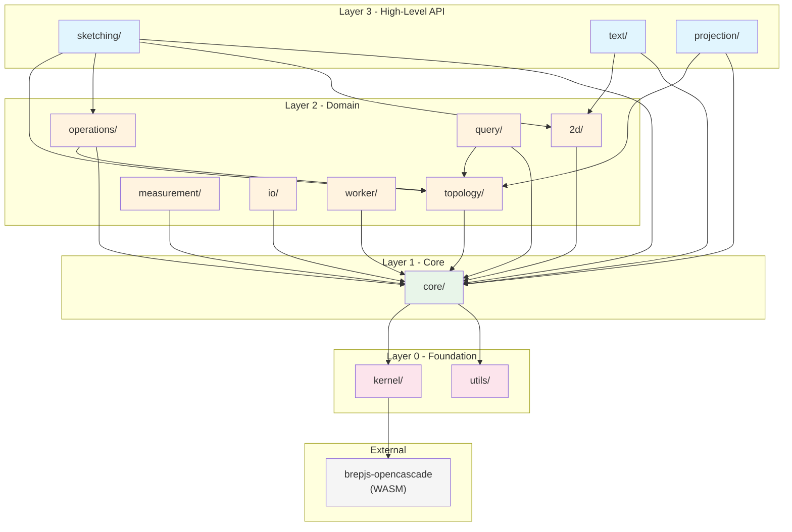
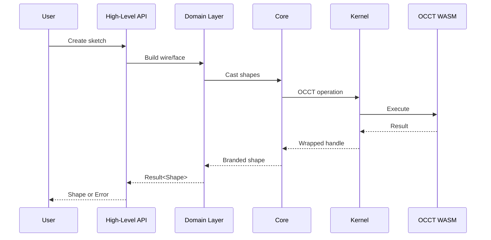

# Architecture

brepjs uses a strict layered architecture with enforced import boundaries.

## Layer Diagram



## Layers

### Layer 0: Foundation

No internal imports allowed.

| Module    | Purpose                          |
| --------- | -------------------------------- |
| `kernel/` | WASM adapter, OCCT bindings      |
| `utils/`  | Pure utilities (no dependencies) |

### Layer 1: Core

Imports kernel/utils only.

| Module  | Purpose                                                       |
| ------- | ------------------------------------------------------------- |
| `core/` | Memory management, types, geometry primitives, error handling |

### Layer 2: Domain

Imports layers 0-1 and each other.

| Module         | Purpose                                                   |
| -------------- | --------------------------------------------------------- |
| `topology/`    | Shape classes, boolean operations, casting                |
| `operations/`  | Extrusion, loft, sweep, batch operations                  |
| `2d/`          | Blueprints, curves, 2D operations                         |
| `query/`       | Shape finders (face, edge, corner)                        |
| `measurement/` | Volume, area, length, distance                            |
| `io/`          | Import/export (STEP, STL, IGES, SVG, glTF, DXF, 3MF, OBJ) |
| `worker/`      | Off-main-thread worker protocol                           |

### Layer 3: High-Level API

Imports all lower layers.

| Module        | Purpose                                 |
| ------------- | --------------------------------------- |
| `sketching/`  | Sketcher API, sketch-to-shape workflows |
| `text/`       | Text blueprints from fonts              |
| `projection/` | Camera and projection utilities         |

## Data Flow



## Key Patterns

### 1. Functional API

brepjs uses an immutable functional API:

```typescript
const box = makeBox([0, 0, 0], [10, 10, 10]);
const moved = translateShape(box, [5, 0, 0]); // Returns new shape
```

### 2. Result Types

All fallible operations return `Result<T, BrepError>`:

```typescript
const result = fuseShape(a, b);
if (isOk(result)) {
  // result.value is the fused shape
}
```

### 3. Branded Types

Shapes use branded types for type safety:

```typescript
declare const __brand: unique symbol;
type Solid = ShapeHandle & { readonly [__brand]: 'solid' };
type Face = ShapeHandle & { readonly [__brand]: 'face' };

// Compiler prevents mixing
function takeSolid(s: Solid) {}
takeSolid(face); // Error: Face not assignable to Solid
```

### 4. Scoped Resource Management

OCCT objects are cleaned up via scopes:

```typescript
const r = gcWithScope();
const temp1 = r(makeBox([10, 10, 10]));
const temp2 = r(makeCylinder(5, 20));
// temp1, temp2 cleaned up when scope exits
```

## Boundary Enforcement

Import boundaries are enforced by:

1. **`scripts/check-layer-boundaries.sh`** — Pre-commit hook
2. **CI workflow** — Runs on every PR
3. **ESLint rules** — Prevents upward imports

To check manually:

```bash
npm run check:boundaries
```

## Module Index

See each module's README for detailed documentation:

- [kernel/README.md](../src/kernel/README.md)
- [core/README.md](../src/core/README.md)
- [topology/README.md](../src/topology/README.md)
- [operations/README.md](../src/operations/README.md)
- [2d/README.md](../src/2d/README.md)
- [query/README.md](../src/query/README.md)
- [measurement/README.md](../src/measurement/README.md)
- [io/README.md](../src/io/README.md)
- [sketching/README.md](../src/sketching/README.md)
- [text/README.md](../src/text/README.md)
- [projection/README.md](../src/projection/README.md)
