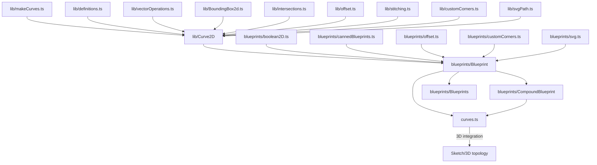

# 2D

**Layer 2** — 2D curves, blueprints, and 2D boolean operations.

## Subdirectories

| Directory     | Purpose                                                                     |
| ------------- | --------------------------------------------------------------------------- |
| `lib/`        | Low-level 2D curve operations — factories, intersections, offset, stitching |
| `blueprints/` | High-level drawing abstractions (Blueprint, CompoundBlueprint, Blueprints)  |

## Key Files (lib/)

| File                  | Purpose                                                                                                                               |
| --------------------- | ------------------------------------------------------------------------------------------------------------------------------------- |
| `Curve2D.ts`          | Core `Curve2D` class — geomType, firstPoint/lastPoint, boundingBox, value(t), tangentAt, splitAt, distanceFrom, serialize/deserialize |
| `makeCurves.ts`       | Curve factories — segment, 3-point arc, tangent arc, circle, ellipse, ellipse arc, Bezier, interpolated B-spline                      |
| `intersections.ts`    | `intersectCurves()`, `selfIntersections()`                                                                                            |
| `offset.ts`           | `make2dOffset(curve, offset)`                                                                                                         |
| `definitions.ts`      | `Point2D`, `Matrix2X2` types                                                                                                          |
| `vectorOperations.ts` | 2D vector math utilities                                                                                                              |
| `BoundingBox2d.ts`    | 2D bounding box representation                                                                                                        |
| `stitching.ts`        | `stitchCurves()` connects curves into continuous paths                                                                                |
| `customCorners.ts`    | `filletCurves()`, `chamferCurves()` for curve connections                                                                             |
| `svgPath.ts`          | SVG path conversion utilities                                                                                                         |

## Key Files (blueprints/)

| File                   | Purpose                                                                                                                                              |
| ---------------------- | ---------------------------------------------------------------------------------------------------------------------------------------------------- |
| `Blueprint.ts`         | Single closed/open 2D path — `.curves`, `.boundingBox`, `.orientation`, `.sketchOnPlane()`, `.sketchOnFace()`, `.toSVG()`, `.isInside()`, transforms |
| `CompoundBlueprint.ts` | Outer contour + inner holes representation                                                                                                           |
| `Blueprints.ts`        | Collection of independent blueprints                                                                                                                 |
| `boolean2D.ts`         | `fuse2D()`, `cut2D()`, `intersect2D()` — 2D boolean operations                                                                                       |
| `cannedBlueprints.ts`  | Pre-built shapes — `roundedRectangleBlueprint()`, `polysidesBlueprint()`                                                                             |
| `offset.ts`            | Blueprint offsetting operations                                                                                                                      |
| `customCorners.ts`     | Fillet/chamfer operations on blueprints                                                                                                              |
| `svg.ts`               | SVG export for blueprints                                                                                                                            |

## Top-Level Files

| File        | Purpose                                                                                                                      |
| ----------- | ---------------------------------------------------------------------------------------------------------------------------- |
| `curves.ts` | 3D integration — `curvesAsEdgesOnPlane()`, `curvesAsEdgesOnFace()`, `edgeToCurve()`, `Transformation2D` class with factories |

## Gotchas

1. **Self-contained 2D module** — `Curve2D` and `Blueprint` don't depend on 3D topology; they're pure 2D abstractions
2. **Bridge to 3D** — `Blueprint.sketchOnPlane()` bridges 2D→3D by creating a `Sketch` on a plane; use this to convert 2D drawings to 3D geometry
3. **Compound blueprints** — `CompoundBlueprint` has outer + inner contours; inner contours become holes when extruded to 3D
4. **2D booleans** — `fuse2D()`/`cut2D()`/`intersect2D()` operate on blueprints, not 3D shapes; use before 3D conversion
5. **Serialization** — `Curve2D.serialize()` enables persistence; curves can be saved and restored without OCCT dependencies
