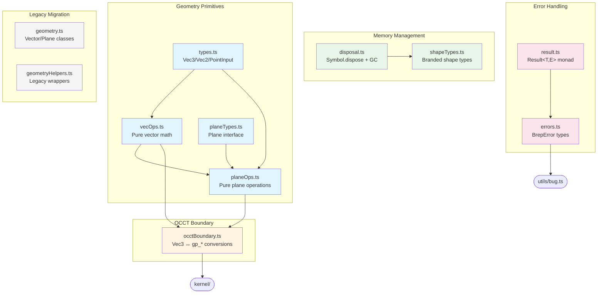

# Core

Layer 1 foundation providing memory management, immutable geometry primitives, Result types, error handling, and OCCT boundary conversions.

## Architecture



## Key Files

| File                 | Purpose                                                            | Dependencies                                                |
| -------------------- | ------------------------------------------------------------------ | ----------------------------------------------------------- |
| `types.ts`           | Core geometry types: `Vec3`, `Vec2`, `PointInput`, `Direction`     | None                                                        |
| `vecOps.ts`          | Pure vector math operations (add, cross, normalize, etc.)          | `types.ts`                                                  |
| `planeTypes.ts`      | `Plane` interface, `PlaneName` union, `PlaneInput`                 | `types.ts`                                                  |
| `planeOps.ts`        | Pure plane operations (create, transform, coord conversion)        | `types.ts`, `planeTypes.ts`, `vecOps.ts`, `occtBoundary.ts` |
| `occtBoundary.ts`    | Bridge between Vec3/Plane and OCCT gp\_\* types                    | `types.ts`, `kernel/`                                       |
| `disposal.ts`        | TC39 `Symbol.dispose` resource management + GC safety net          | `kernel/types.js`                                           |
| `shapeTypes.ts`      | Branded shape types (`Vertex`, `Edge`, `Solid`, etc.)              | `disposal.ts`, `kernel/`                                    |
| `result.ts`          | Rust-style `Result<T,E>` for error handling                        | None                                                        |
| `errors.ts`          | `BrepError` types and constructor functions                        | `utils/bug.js`                                              |
| `constants.ts`       | `HASH_CODE_MAX`, `DEG2RAD`, `RAD2DEG`                              | None                                                        |
| `definitionMaps.ts`  | `CurveType` union, lazy OCCT enum mappings                         | None                                                        |
| `memory.ts`          | Re-export hub for disposal utilities                               | `disposal.ts`                                               |
| `geometry.ts`        | Re-export hub + legacy `Vector`, `Plane`, `Transformation` classes | All above                                                   |
| `geometryHelpers.ts` | Legacy wrapper functions (migration support)                       | `geometry.ts`                                               |

## Geometry Primitives (Functional, Immutable)

### Type Definitions (`types.ts`)

**Core types:**

- `Vec3 = readonly [number, number, number]` - Immutable 3D vector/point
- `Vec2 = readonly [number, number]` - Immutable 2D point
- `PointInput` - Union accepting `Vec3 | Vec2 | readonly [n,n,n] | readonly [n,n]`
- `Direction` - Either `Vec3` or named axis `'X' | 'Y' | 'Z'`

**Conversion functions:**

- `toVec3(p: PointInput): Vec3` - Normalize any input to Vec3 (2D gets z=0)
- `toVec2(p: PointInput): Vec2` - Extract 2D coordinates (drops z)
- `resolveDirection(d: Direction): Vec3` - Convert named axis or pass through Vec3

### Vector Operations (`vecOps.ts`)

**Arithmetic:**

```typescript
vecAdd(a, b); // a + b
vecSub(a, b); // a - b
vecScale(v, s); // v * s
vecNegate(v); // -v
```

**Products:**

```typescript
vecDot(a, b); // a · b (scalar)
vecCross(a, b); // a × b (vector)
```

**Length/Distance:**

```typescript
vecLength(v); // ||v||
vecLengthSq(v); // ||v||² (faster, no sqrt)
vecDistance(a, b); // ||b - a||
vecNormalize(v); // v / ||v|| (returns [0,0,0] if zero)
```

**Comparison:**

```typescript
vecEquals(a, b, (tolerance = 1e-5)); // Component-wise comparison
vecIsZero(v, (tolerance = 1e-10)); // ||v||² < tolerance²
```

**Geometry:**

```typescript
vecAngle(a, b); // Angle between vectors (radians)
vecProjectToPlane(v, origin, normal); // Project onto plane
vecRotate(v, axis, angleRad); // Rodrigues rotation formula
```

**2D variants:** `vec2Add`, `vec2Sub`, `vec2Scale`, `vec2Length`, `vec2Distance`, `vec2Normalize`, `vec2Equals`

### Plane Types (`planeTypes.ts`)

```typescript
interface Plane {
  readonly origin: Vec3;
  readonly xDir: Vec3; // Normalized X axis of plane coordinate system
  readonly yDir: Vec3; // Normalized Y axis (orthogonal to x and z)
  readonly zDir: Vec3; // Normalized normal vector
}

type PlaneName =
  | 'XY'
  | 'YZ'
  | 'ZX'
  | 'XZ'
  | 'YX'
  | 'ZY'
  | 'front'
  | 'back'
  | 'left'
  | 'right'
  | 'top'
  | 'bottom';

type PlaneInput = Plane | PlaneName;
```

### Plane Operations (`planeOps.ts`)

**Construction:**

```typescript
createPlane(
  origin: Vec3,
  xDirection: Vec3 | null = null,  // Auto-derived from OCCT if null
  normal: Vec3 = [0, 0, 1]
): Plane

createNamedPlane(
  name: PlaneName,
  sourceOrigin: PointInput | number = [0, 0, 0]  // Offset along normal if number
): Result<Plane>

resolvePlane(input: PlaneInput, origin?: PointInput | number): Plane
```

**Coordinate Transforms:**

```typescript
planeToWorld(plane: Plane, local: Vec2): Vec3    // 2D → 3D
planeToLocal(plane: Plane, world: Vec3): Vec2    // 3D → 2D projection
```

**Transformations (all pure, return new Plane):**

```typescript
translatePlane(plane, offset); // Move by vector
translatePlaneTo(plane, newOrigin); // Move to position
pivotPlane(plane, angleDeg, axis); // Rotate plane around axis
rotatePlane2DAxes(plane, angleDeg); // Rotate 2D coords around normal
```

## OCCT Boundary Layer (`occtBoundary.ts`)

Bridges brepjs functional geometry with OCCT's mutable gp\_\* types. **Critical:** All OCCT objects are temporary and require manual cleanup.

### Direct Conversions (Caller Must Delete)

```typescript
toOcVec(v: Vec3): gp_Vec          // Caller must call .delete()
toOcPnt(v: Vec3): gp_Pnt          // Caller must call .delete()
toOcDir(v: Vec3): gp_Dir          // Caller must call .delete()
pointToOcPnt(p: PointInput): gp_Pnt
pointToOcDir(p: PointInput): gp_Dir
```

### Extraction (No Cleanup Needed)

```typescript
fromOcVec(ocVec): Vec3
fromOcPnt(ocPnt): Vec3
fromOcDir(ocDir): Vec3
```

### Scoped Conversions (Auto-Cleanup)

```typescript
withOcVec<T>(v: Vec3, fn: (ocVec: gp_Vec) => T): T
withOcPnt<T>(v: Vec3, fn: (ocPnt: gp_Pnt) => T): T
withOcDir<T>(v: Vec3, fn: (ocDir: gp_Dir) => T): T
```

**Example:**

```typescript
const result = withOcPnt([1, 2, 3], (pnt) => {
  // Use pnt here
  return someOcctOperation(pnt);
}); // pnt.delete() called automatically
```

### Axis Helpers (Caller Must Delete)

```typescript
makeOcAx1(center: Vec3, dir: Vec3): gp_Ax1
makeOcAx2(origin: Vec3, zDir: Vec3, xDir?: Vec3): gp_Ax2
makeOcAx3(origin: Vec3, zDir: Vec3, xDir?: Vec3): gp_Ax3
```

## Memory Management (`disposal.ts`, `memory.ts`)

Uses **TC39 Explicit Resource Management** (`Symbol.dispose`) with `FinalizationRegistry` as safety net.

### Core Interfaces

```typescript
interface ShapeHandle {
  readonly wrapped: OcShape; // Raw OCCT shape
  readonly disposed: boolean;
  [Symbol.dispose](): void;
}

interface OcHandle<T extends Deletable> {
  readonly value: T;
  readonly disposed: boolean;
  [Symbol.dispose](): void;
}
```

### Handle Creation

```typescript
createHandle(ocShape: OcShape): ShapeHandle
createOcHandle<T>(ocObj: T): OcHandle<T>
```

**Usage with `using` declaration (auto-disposal):**

```typescript
using solid = createSolid(ocShape);
// solid.dispose() called automatically at end of scope
```

### Disposal Scope

```typescript
class DisposalScope {
  register<T extends Deletable>(resource: T): T;
  track<T extends Disposable>(disposable: T): T;
  [Symbol.dispose](): void;
}

function withScope<T>(fn: (scope: DisposalScope) => T): T;
```

**Example:**

```typescript
withScope((scope) => {
  const pnt1 = scope.register(new oc.gp_Pnt_3(0, 0, 0));
  const pnt2 = scope.register(new oc.gp_Pnt_3(1, 1, 1));
  return distance(pnt1, pnt2);
  // Both points auto-deleted when scope ends
});
```

### Backward-Compatible GC Helpers

```typescript
gcWithScope(): <T extends Deletable>(value: T) => T
gcWithObject(obj: any): <T extends Deletable>(value: T) => T
localGC(debug?: boolean): [
  <T extends Deletable>(v: T) => T,  // register
  () => void,                        // cleanup
  Set<Deletable> | undefined         // debug set
]
```

## Shape Types (`shapeTypes.ts`)

**Branded types** for type-safe shape discrimination without class hierarchies.

### Type Hierarchy

```typescript
type ShapeKind = 'vertex' | 'edge' | 'wire' | 'face' | 'shell' | 'solid' | 'compsolid' | 'compound';

type Vertex = ShapeHandle & { readonly [__brand]: 'vertex' };
type Edge = ShapeHandle & { readonly [__brand]: 'edge' };
type Wire = ShapeHandle & { readonly [__brand]: 'wire' };
type Face = ShapeHandle & { readonly [__brand]: 'face' };
type Shell = ShapeHandle & { readonly [__brand]: 'shell' };
type Solid = ShapeHandle & { readonly [__brand]: 'solid' };
type CompSolid = ShapeHandle & { readonly [__brand]: 'compsolid' };
type Compound = ShapeHandle & { readonly [__brand]: 'compound' };

type AnyShape = Vertex | Edge | Wire | Face | Shell | Solid | CompSolid | Compound;
type Shape1D = Edge | Wire;
type Shape3D = Shell | Solid | CompSolid | Compound;
```

### Factory Functions

**Use these instead of manual casting:**

```typescript
createVertex(ocShape: OcShape): Vertex
createEdge(ocShape: OcShape): Edge
createWire(ocShape: OcShape): Wire
createFace(ocShape: OcShape): Face
createShell(ocShape: OcShape): Shell
createSolid(ocShape: OcShape): Solid
createCompSolid(ocShape: OcShape): CompSolid
createCompound(ocShape: OcShape): Compound
```

### Type Guards (Runtime Checks)

```typescript
getShapeKind(shape: AnyShape): ShapeKind

isVertex(s: AnyShape): s is Vertex
isEdge(s: AnyShape): s is Edge
isWire(s: AnyShape): s is Wire
isFace(s: AnyShape): s is Face
isShell(s: AnyShape): s is Shell
isSolid(s: AnyShape): s is Solid
isCompound(s: AnyShape): s is Compound
isShape3D(s: AnyShape): s is Shape3D
isShape1D(s: AnyShape): s is Shape1D
```

### Shape Casting

```typescript
castShape(ocShape: OcShape): AnyShape
```

Performs OCCT `TopoDS` downcast and wraps in correct branded type.

## Error Handling (`result.ts`, `errors.ts`)

### Result Type (Rust-inspired)

```typescript
type Result<T, E = BrepError> = Ok<T> | Err<E>;

interface Ok<T> {
  readonly ok: true;
  readonly value: T;
}

interface Err<E> {
  readonly ok: false;
  readonly error: E;
}
```

**Constructors:**

```typescript
ok<T>(value: T): Ok<T>
err<E>(error: E): Err<E>
const OK: Ok<undefined>  // Convenience constant
```

**Type Guards:**

```typescript
isOk<T, E>(result: Result<T, E>): result is Ok<T>
isErr<T, E>(result: Result<T, E>): result is Err<E>
```

**Combinators:**

```typescript
map<T, U, E>(result: Result<T, E>, fn: (value: T) => U): Result<U, E>
mapErr<T, E, F>(result: Result<T, E>, fn: (error: E) => F): Result<T, F>
andThen<T, U, E>(result: Result<T, E>, fn: (value: T) => Result<U, E>): Result<U, E>
flatMap = andThen  // Alias
```

**Extraction:**

```typescript
unwrap<T, E>(result: Result<T, E>): T                // Throws on Err
unwrapOr<T, E>(result: Result<T, E>, defaultValue: T): T
unwrapOrElse<T, E>(result: Result<T, E>, fn: (error: E) => T): T
unwrapErr<T, E>(result: Result<T, E>): E            // Throws on Ok
```

**Pattern Matching:**

```typescript
match<T, E, U>(
  result: Result<T, E>,
  handlers: { ok: (value: T) => U; err: (error: E) => U }
): U
```

**Collection:**

```typescript
collect<T, E>(results: Result<T, E>[]): Result<T[], E>  // Short-circuits on first Err
```

**Try-Catch Boundary:**

```typescript
tryCatch<T, E>(fn: () => T, mapError: (error: unknown) => E): Result<T, E>
tryCatchAsync<T, E>(fn: () => Promise<T>, mapError: (error: unknown) => E): Promise<Result<T, E>>
```

### Error Types

```typescript
type BrepErrorKind =
  | 'OCCT_OPERATION' // OCCT API failures
  | 'VALIDATION' // Invalid input/state
  | 'TYPE_CAST' // Shape type mismatches
  | 'SKETCHER_STATE' // Sketcher workflow errors
  | 'MODULE_INIT' // WASM/kernel initialization
  | 'COMPUTATION' // Mathematical computation failures
  | 'IO' // File I/O errors
  | 'QUERY'; // Query operation failures

interface BrepError {
  readonly kind: BrepErrorKind;
  readonly code: string;
  readonly message: string;
  readonly cause?: unknown;
}
```

**Constructor Functions:**

```typescript
occtError(code, message, cause?): BrepError
validationError(code, message, cause?): BrepError
typeCastError(code, message, cause?): BrepError
sketcherStateError(code, message, cause?): BrepError
moduleInitError(code, message, cause?): BrepError
computationError(code, message, cause?): BrepError
ioError(code, message, cause?): BrepError
queryError(code, message, cause?): BrepError
```

**Bug Reporting (re-exported from `utils/bug.ts`):**

```typescript
bug(message: string): never          // Throws BrepBugError
class BrepBugError extends Error
```

## Constants (`constants.ts`)

```typescript
export const HASH_CODE_MAX = 2147483647; // Max int32 for OCCT hash codes
export const DEG2RAD = Math.PI / 180;
export const RAD2DEG = 180 / Math.PI;
```

## Definition Maps (`definitionMaps.ts`)

Lazy mappings between brepjs types and OCCT enums.

```typescript
type CurveType =
  | 'LINE'
  | 'CIRCLE'
  | 'ELLIPSE'
  | 'HYPERBOLA'
  | 'PARABOLA'
  | 'BEZIER_CURVE'
  | 'BSPLINE_CURVE'
  | 'OFFSET_CURVE'
  | 'OTHER_CURVE';
```

OCCT enum mappings are created lazily on first access.

## Legacy Migration (`geometry.ts`, `geometryHelpers.ts`)

**These are being phased out in favor of functional API.**

### Legacy Classes (geometry.ts)

```typescript
class Vector {
  constructor(x, y, z);
  toXYZ(): readonly [number, number, number];
  // ... mutable methods
}

class Plane {
  constructor(origin, xDir, normal);
  localToWorld(u, v): Vector;
  // ... mutable methods
}

class Transformation {
  /* ... */
}
class BoundingBox {
  /* ... */
}
```

### Legacy Helpers (geometryHelpers.ts)

```typescript
makePlane(origin, xDirection, normal): Plane
makePlaneFromFace(face): Plane
rotate(angleDegrees, direction): Transformation
translate(offset): Transformation
mirror(plane, origin?): Transformation
scale(factor, center?): Transformation
```

**Migration Path:** Prefer functional equivalents from `planeOps.ts` and `vecOps.ts`.

## Gotchas

1. **Vec3/Vec2 are readonly tuples** - Never mutate. Always create new tuples:

   ```typescript
   // Wrong:
   const v: Vec3 = [1, 2, 3];
   v[0] = 5; // TypeScript error: readonly property

   // Right:
   const v2 = vecAdd(v, [4, 0, 0]);
   ```

2. **OCCT cleanup responsibility** - Direct conversions require manual cleanup:

   ```typescript
   // Wrong (memory leak):
   const pnt = toOcPnt([0, 0, 0]);
   someOperation(pnt);
   // pnt never deleted!

   // Right:
   const pnt = toOcPnt([0, 0, 0]);
   try {
     someOperation(pnt);
   } finally {
     pnt.delete();
   }

   // Better - scoped:
   withOcPnt([0, 0, 0], (pnt) => someOperation(pnt));
   ```

3. **Legacy class coexistence** - During migration, both functional and class-based APIs coexist:

   ```typescript
   // Old (being phased out):
   const v = new Vector(1, 2, 3);
   const len = v.Length();

   // New (preferred):
   const v: Vec3 = [1, 2, 3];
   const len = vecLength(v);
   ```

4. **FinalizationRegistry is safety net, not primary cleanup** - Always dispose explicitly:

   ```typescript
   // Risky (relies on GC):
   function makeSolid() {
     return createSolid(ocShape); // GC will eventually clean up
   }

   // Proper:
   using solid = createSolid(ocShape); // Deterministic cleanup
   ```

5. **Branded types use unique symbols** - Don't bypass type system:

   ```typescript
   // Wrong:
   const solid = ocShape as Solid; // Brand not applied

   // Right:
   const solid = createSolid(ocShape); // Factory applies brand
   // Or:
   const shape = castShape(ocShape); // Auto-detects type
   ```

6. **Tolerance defaults differ by use case**:

   ```typescript
   vecEquals(a, b); // Default: 1e-5 (geometric equality)
   vecIsZero(v); // Default: 1e-10 (stricter for zero check)
   ```

7. **Plane normal auto-normalization** - `createPlane` normalizes inputs:

   ```typescript
   const plane = createPlane([0, 0, 0], null, [0, 0, 5]);
   // plane.zDir === [0, 0, 1] (normalized)
   ```

8. **Named plane origin offsets** - Number argument offsets along normal:

   ```typescript
   createNamedPlane('XY', 5); // Plane at z=5
   createNamedPlane('XY', [1, 2, 3]); // Plane at [1,2,3]
   ```

9. **Result type short-circuits** - `collect()` stops at first error:

   ```typescript
   const results = [ok(1), err('fail'), ok(3)];
   const combined = collect(results); // Err('fail'), never evaluates ok(3)
   ```

10. **Disposal order matters** - `DisposalScope` disposes in **reverse order (LIFO)**:
    ```typescript
    withScope((scope) => {
      const a = scope.register(makeA()); // Registered first
      const b = scope.register(makeB()); // Registered second
      // b disposed first, then a
    });
    ```
