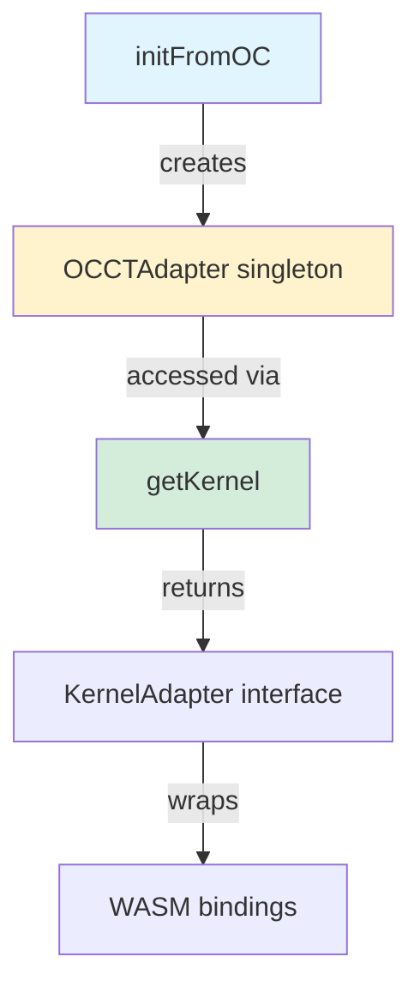

# Kernel

OCCT WASM abstraction layer providing unified interface to OpenCascade operations.

## Key Files

| File              | Purpose                                                                                                                                                                                                  |
| ----------------- | -------------------------------------------------------------------------------------------------------------------------------------------------------------------------------------------------------- |
| `index.ts`        | Singleton accessor `getKernel()`, bootstrap `initFromOC(oc)`, type re-exports                                                                                                                            |
| `types.ts`        | Type aliases (`OpenCascadeInstance`, `OcShape`, `OcType` all `any`), `ShapeType` union, `BooleanOptions`, `MeshOptions`, `KernelMeshResult`, `KernelAdapter` interface                                   |
| `occtAdapter.ts`  | `OCCTAdapter` class implementing shape construction, extrusion/sweep/loft, modification (fillet/chamfer/shell/offset), topology iteration with hash deduplication. Delegates to operation modules below. |
| `ioOps.ts`        | File I/O operations: `exportSTEP`, `exportSTL`, `importSTEP`, `importSTL` — uses emscripten virtual filesystem                                                                                           |
| `measureOps.ts`   | Measurement operations: `volume`, `area`, `length`, `centerOfMass`, `boundingBox` — wraps BRepGProp                                                                                                      |
| `transformOps.ts` | Transform operations: `transform`, `translate`, `rotate`, `mirror`, `scale`, `simplify` — wraps gp_Trsf and BRepBuilderAPI_Transform                                                                     |
| `booleanOps.ts`   | Boolean operations: `fuse`, `cut`, `intersect`, `fuseAll`, `cutAll`, `buildCompound`, `applyGlue` — with batch/native/pairwise implementations                                                           |
| `meshOps.ts`      | Meshing operations: `mesh`, `meshEdges` with dual implementations (C++ bulk `MeshExtractor`/`EdgeMeshExtractor` or JS `TopExp_Explorer` fallback)                                                        |
| `topologyOps.ts`  | Topology iteration: `iterShapes`, `shapeType`, `isSame`, `isEqual` — with dual implementations (C++ `TopologyExtractor` or JS `TopExp_Explorer` fallback)                                                |

## Gotchas

1. **Must initialize first** — Call `initFromOC(oc)` before any `getKernel()` call, throws descriptive error if not initialized
2. **Manual memory management** — All intermediate OCCT objects need `.delete()`, only final returned shapes are kept alive
3. **Dynamic types** — `OcShape`/`OcType`/`OpenCascadeInstance` are typed as `any` with lint exemptions because OCCT WASM bindings lack TypeScript types
4. **Recursive fusion** — `fuseAll` uses recursive pairwise fusion (not compounds) because OCCT requires non-self-intersecting inputs
5. **Dual mesh path** — Mesh has two implementations in `meshOps.ts`: bulk C++ `MeshExtractor` if available, JS `TopExp_Explorer` fallback
6. **Virtual filesystem** — File I/O uses emscripten virtual filesystem, not real disk paths
7. **Degree conversion** — `rotate()` takes degrees, converts internally to radians
