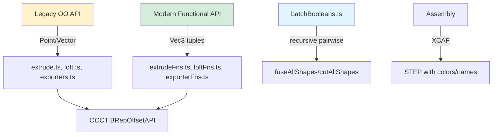

# Operations

Extrusion, loft, sweep, batch booleans, and assembly export with dual API (OO + functional).

## Key Files

| File               | Purpose                                                                                                                                                                                                                                                                                                                                                                                                                                                                                                  |
| ------------------ | -------------------------------------------------------------------------------------------------------------------------------------------------------------------------------------------------------------------------------------------------------------------------------------------------------------------------------------------------------------------------------------------------------------------------------------------------------------------------------------------------------- |
| `extrude.ts`       | OO API: `basicFaceExtrusion(face, vec)` simple prism, `revolution(face, center?, dir?, angle?)` revolve face, `genericSweep(wire, spine, config?)` pipe with `GenericSweepConfig` (frenet, auxiliarySpine, law, transitionMode, withContact, support, forceProfileSpineOthogonality), `complexExtrude(face, vec, profile)` with `ExtrusionProfile` (profile: 's-curve'/'linear', endFactor), `twistExtrude(face, vec, angle)` helical extrusion, `supportExtrude(face, spine, support)` sweep on surface |
| `extrudeFns.ts`    | Functional API: Same operations as extrude.ts but accepts Vec3 tuples `[x, y, z]` instead of Point/Vector objects                                                                                                                                                                                                                                                                                                                                                                                        |
| `loft.ts`          | OO API: `loft(wires, config?, returnShell?)` creates solid/shell through wire sections with `LoftConfig` (ruled: boolean defaults true, startPoint?: Point, endPoint?: Point)                                                                                                                                                                                                                                                                                                                            |
| `loftFns.ts`       | Functional API: `loftWires(wires, config?)` with Vec3 tuple points                                                                                                                                                                                                                                                                                                                                                                                                                                       |
| `exporters.ts`     | OO API: `createAssembly(shapes?)` builds XCAF document, `exportSTEP(shapes?, options?)` writes STEP file with `ShapeConfig[]` (shape, color: hex string, alpha: 0-1, name), `SupportedUnit` ('M'/'CM'/'MM'/'INCH'/'FT' + lowercase), XCAF preserves metadata (colors/layers/names)                                                                                                                                                                                                                       |
| `exporterFns.ts`   | Functional API: `exportAssemblySTEP(shapes?, options?)` same STEP export with Vec3 compatibility                                                                                                                                                                                                                                                                                                                                                                                                         |
| `batchBooleans.ts` | `fuseAllShapes(shapes, options?)` recursive pairwise fusion avoiding self-intersection issues, `cutAllShapes(base, tools, options?)` batch subtraction with `BooleanOperationOptions` (optimisation: 'none'/'bop'/'common', simplify: boolean)                                                                                                                                                                                                                                                           |

## Gotchas

1. **Dual API surface** — Each operation exists in OO form (`extrude.ts`, `loft.ts`, `exporters.ts`) using Point/Vector objects AND functional form (`*Fns.ts`) using Vec3 tuples `[x, y, z]`. Prefer functional API for new code.
2. **Sweep shellMode overload** — `genericSweep(wire, spine, config, true)` returns `Result<[Shape3D, Wire, Wire]>` tuple (shape + start/end wires) instead of just `Result<Shape3D>` when shellMode is false.
3. **Complex extrude profiles** — `complexExtrude` with `profile: 's-curve'` uses BSpline law for smooth tapering, `profile: 'linear'` uses linear scaling. `endFactor` controls final scale (0.5 = 50% taper).
4. **Recursive pairwise fusion** — `fuseAllShapes` uses divide-and-conquer recursive pairwise fuse instead of compound fusion because OCCT requires non-self-intersecting inputs for boolean operations.
5. **XCAF metadata preservation** — `createAssembly` + `exportSTEP` preserves shape colors/names/layers via XCAF document. Plain topology exports lose this metadata.
6. **Loft ruled default** — `loft` defaults to `ruled: true` for straight-ruled surface. Set `ruled: false` for smooth interpolated surface through wire sections.
7. **Unit case sensitivity** — `SupportedUnit` accepts both uppercase ('M', 'MM') and lowercase ('m', 'mm') for backward compatibility.
