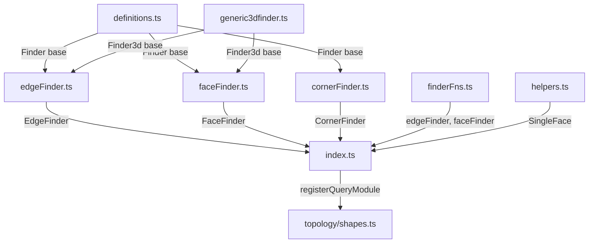

# Query

**Layer 2** — Fluent finders for edges, faces, and corners.



## Key Files

| File                 | Purpose                                                                                        |
| -------------------- | ---------------------------------------------------------------------------------------------- |
| `definitions.ts`     | Abstract `Finder<Type, FilterType>` base with filter composition (and, or, not, either, when)  |
| `finderFns.ts`       | Functional immutable finders: `edgeFinder()`, `faceFinder()`, `combineFinderFilters()`         |
| `edgeFinder.ts`      | `EdgeFinder` class: filters by direction, length, curve type, distance, box, point             |
| `faceFinder.ts`      | `FaceFinder` class: filters by direction, plane, surface type, distance, box                   |
| `cornerFinder.ts`    | `CornerFinder` for 2D blueprint corners by angle, distance, position                           |
| `generic3dfinder.ts` | `Finder3d` base with common 3D spatial filters (atDistance, inBox, containsPoint, atAngleWith) |
| `helpers.ts`         | `SingleFace` type resolution helper                                                            |
| `index.ts`           | Barrel re-exports and `combineFinderFilters()` utility                                         |

## EdgeFinder Filters

| Filter            | Purpose                                                 |
| ----------------- | ------------------------------------------------------- |
| `inDirection()`   | Edges aligned with X/Y/Z or custom direction (angle 0°) |
| `parallelTo()`    | Edges parallel to a plane or face (angle 90°)           |
| `ofLength()`      | Edges of specific length or matching predicate          |
| `ofCurveType()`   | Edges of specific curve type (line, circle, etc.)       |
| `inPlane()`       | Edges within a named or custom plane                    |
| `atDistance()`    | Edges at specific distance from a point                 |
| `containsPoint()` | Edges passing through a point (distance 0)              |
| `inBox()`         | Edges within bounding box                               |

## FaceFinder Filters

| Filter            | Purpose                                      |
| ----------------- | -------------------------------------------- |
| `parallelTo()`    | Faces parallel to plane/face/standard plane  |
| `inPlane()`       | Faces contained in a specific plane          |
| `ofSurfaceType()` | Faces of specific surface type (plane, etc.) |
| `atDistance()`    | Faces at specific distance from a point      |
| `inBox()`         | Faces within bounding box                    |

## CornerFinder Filters

| Filter         | Purpose                              |
| -------------- | ------------------------------------ |
| `ofAngle()`    | Corners with specific angle (0-180°) |
| `atDistance()` | Corners at distance from point       |
| `atPoint()`    | Corners at exact 2D position         |
| `inBox()`      | Corners within 2D bounding box       |
| `inList()`     | Corners matching list of 2D points   |

## Filter Composition

All finders support logical composition:

```typescript
finder
  .and([...])     // Apply multiple filters (default behavior)
  .either([...])  // OR operation
  .not(...)       // Invert filter
  .when(...)      // Custom predicate
```

## Gotchas

1. **Immutable finders** — Each filter call returns a new finder instance; chain calls or save intermediate results
2. **Unique mode errors** — `findUnique(shape)` returns `Result<T>` and errors if 0 or >1 match found
3. **CornerFinder operates on 2D** — Works on `BlueprintLike` objects (2D sketches), not 3D shapes
4. **Direction shortcuts** — Accepts `'X' | 'Y' | 'Z'` strings or `Vec3` tuples like `[1, 0, 0]`
5. **Query module registration** — Must call `registerQueryModule()` or import `query/index.js` before using topology `fillet()`, `chamfer()`, or `shell()` methods
6. **Filter cleanup** — Call `finder.delete()` or use `combineFinderFilters()` cleanup function to release resources
7. **Angle tolerance** — Direction/plane filters use 1e-6 radian tolerance for floating-point safety
8. **Edge tangents may fail** — Degenerate edges lack valid tangents; filters receive `normal: null` and should handle gracefully
