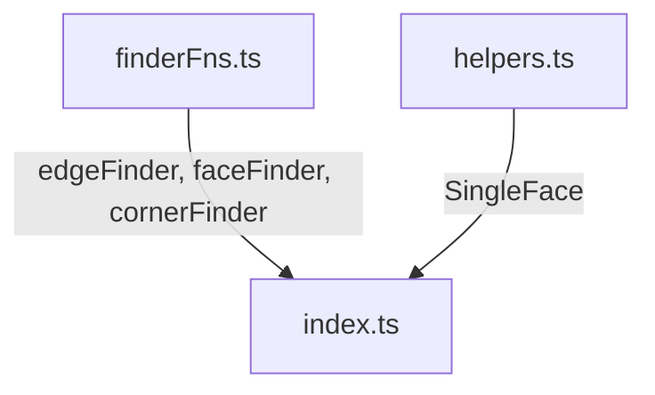

# Query

**Layer 2** — Functional immutable finders for edges, faces, and corners.



## Key Files

| File           | Purpose                                                                        |
| -------------- | ------------------------------------------------------------------------------ |
| `finderFns.ts` | Functional immutable finders: `edgeFinder()`, `faceFinder()`, `cornerFinder()` |
| `helpers.ts`   | `SingleFace` type resolution helper                                            |
| `index.ts`     | Barrel re-exports                                                              |

## edgeFinder() Filters

| Filter          | Purpose                                                 |
| --------------- | ------------------------------------------------------- |
| `inDirection()` | Edges aligned with X/Y/Z or custom direction (angle 0°) |
| `parallelTo()`  | Edges parallel to a plane or face (angle 90°)           |
| `ofLength()`    | Edges of specific length or matching predicate          |
| `ofCurveType()` | Edges of specific curve type (line, circle, etc.)       |
| `atDistance()`  | Edges at specific distance from a point                 |

## faceFinder() Filters

| Filter            | Purpose                                      |
| ----------------- | -------------------------------------------- |
| `inDirection()`   | Faces whose normal aligns with direction     |
| `parallelTo()`    | Faces parallel to plane/face/standard plane  |
| `ofSurfaceType()` | Faces of specific surface type (plane, etc.) |
| `ofArea()`        | Faces with specific area                     |
| `atDistance()`    | Faces at specific distance from a point      |

## cornerFinder() Filters

| Filter         | Purpose                              |
| -------------- | ------------------------------------ |
| `ofAngle()`    | Corners with specific angle (0-180°) |
| `atDistance()` | Corners at distance from point       |
| `atPoint()`    | Corners at exact 2D position         |
| `inBox()`      | Corners within 2D bounding box       |
| `inList()`     | Corners matching list of 2D points   |

## Filter Composition

All finders support logical composition:

```typescript
finder
  .either([...])  // OR operation
  .not(...)       // Invert filter
  .when(...)      // Custom predicate
```

## Gotchas

1. **Immutable finders** — Each filter call returns a new finder instance; chain calls or save intermediate results
2. **Unique mode errors** — `findUnique(shape)` returns `Result<T>` and errors if 0 or >1 match found
3. **cornerFinder operates on 2D** — Works on `BlueprintLike` objects (2D sketches), not 3D shapes
4. **Direction shortcuts** — Accepts `'X' | 'Y' | 'Z'` strings or `Vec3` tuples like `[1, 0, 0]`
5. **Angle tolerance** — Direction/plane filters use 1e-6 radian tolerance for floating-point safety
6. **Edge tangents may fail** — Degenerate edges lack valid tangents; filters receive `normal: null` and should handle gracefully
