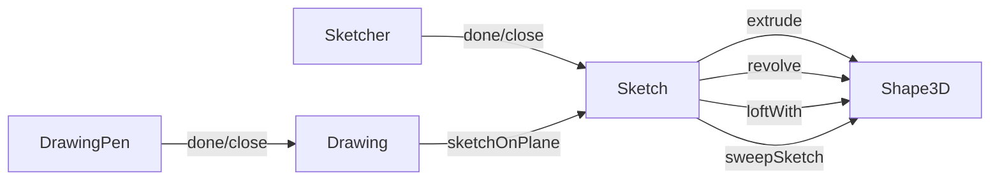

# Sketching

Layer 3 fluent builder API for 2D/3D sketching.

## Key Files

| File                                                           | Description                                                                                                                                                                                                                                                                                                                                           |
| -------------------------------------------------------------- | ----------------------------------------------------------------------------------------------------------------------------------------------------------------------------------------------------------------------------------------------------------------------------------------------------------------------------------------------------- |
| `Sketcher.ts`                                                  | **Sketcher** class for 3D sketching on planes. Constructor takes `Plane` or `PlaneName` with optional origin. Drawing methods: `lineTo/line/hLine/vLine/polarLine/tangentLine`, `threePointsArcTo/tangentArcTo/sagittaArcTo/bulgeArcTo`, `ellipseTo/halfEllipseTo`, `bezierCurveTo/smoothSplineTo`. Finish: `done()`, `close()`, `closeWithMirror()`. |
| `Sketch.ts`                                                    | **Sketch** class representing a wire with default origin/direction. Methods: `extrude(distance)`, `revolve(axis?)`, `loftWith(others)`, `sweepSketch(fn, config)`, `face()`, `wires()`. Used for creating 3D shapes from 2D sketches.                                                                                                                 |
| `Sketcher2d.ts`                                                | **FaceSketcher** for drawing on curved 3D faces (UV coordinates), **BlueprintSketcher** for pure 2D drawing.                                                                                                                                                                                                                                          |
| `CompoundSketch.ts`                                            | **CompoundSketch** class representing a sketch with holes (main sketch + cutouts).                                                                                                                                                                                                                                                                    |
| `Sketches.ts`                                                  | **Sketches** collection class for managing multiple sketch instances.                                                                                                                                                                                                                                                                                 |
| `draw.ts`                                                      | High-level **Drawing** API and **DrawingPen** class. Drawing has: `sketchOnPlane`, `sketchOnFace`, `fuse/cut/intersect` (2D booleans), `fillet/chamfer`, `offset`, `toSVG`. DrawingPen has same drawing methods as Sketcher.                                                                                                                          |
| `shortcuts.ts`                                                 | Convenience functions: `draw(pt?)` returns DrawingPen, `drawRectangle()`, `drawCircle()`, `drawEllipse()`, `drawPolysides()`, `drawText()`, `drawProjection()`.                                                                                                                                                                                       |
| `cannedSketches.ts`                                            | Preset sketch shapes (rectangles, circles, polygons).                                                                                                                                                                                                                                                                                                 |
| `sketchFns.ts`, `sketchLib.ts`, `drawFns.ts`, `sketcherlib.ts` | Internal helper functions and utilities.                                                                                                                                                                                                                                                                                                              |

## Gotchas

1. **Sketch consumption**: Sketch operations (`extrude()`, `revolve()`, etc.) "consume" the sketch by calling `.delete()` internally — the sketch instance cannot be reused after.
2. **Drawing immutability**: Drawings are non-destructive — operations return new Drawing instances.
3. **Relative vs absolute coordinates**: Use `.line(dx, dy)` for relative movement, `.lineTo([x, y])` for absolute positioning.
4. **Mirror symmetry**: `closeWithMirror()` mirrors the drawn path around the start-to-end axis to create symmetric shapes.
5. **UV coordinates**: `FaceSketcher` works on curved 3D surfaces using UV parametric coordinates, not Cartesian.
6. **API differences**: `draw()` returns `DrawingPen` (2D, immutable), `new Sketcher(plane)` creates a 3D plane sketcher (mutable, consumable).
